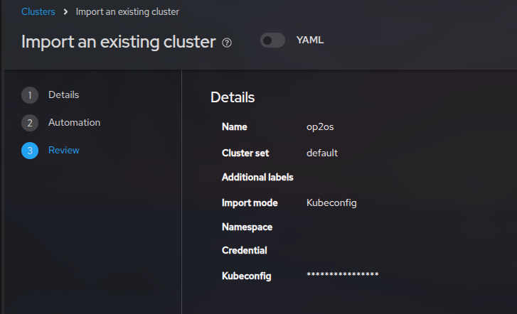
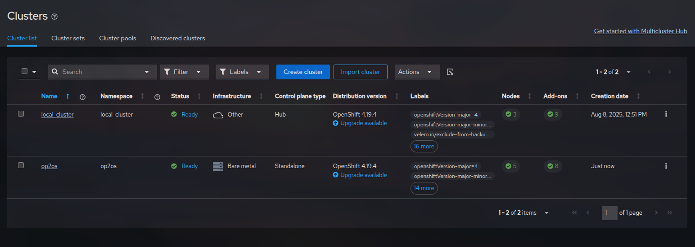
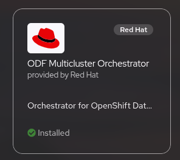
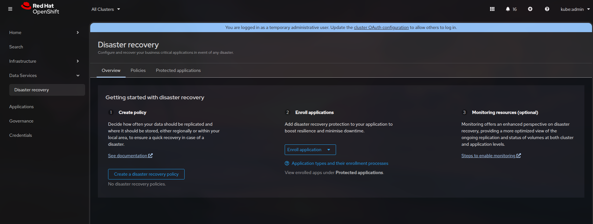
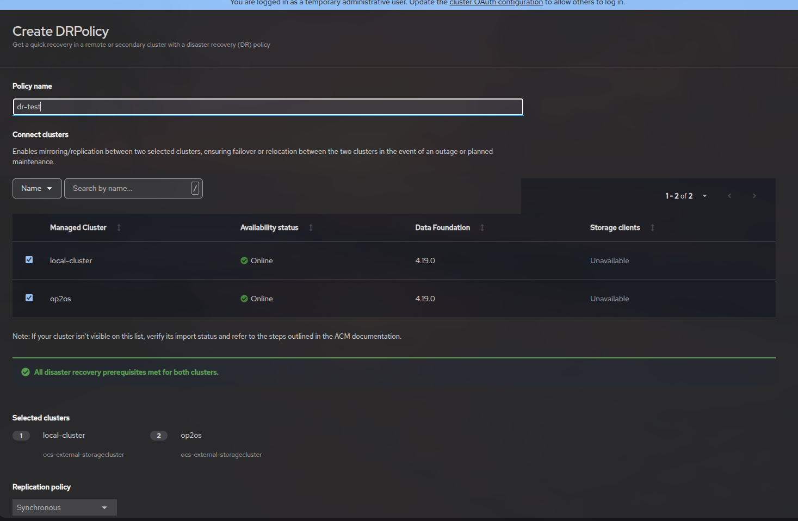
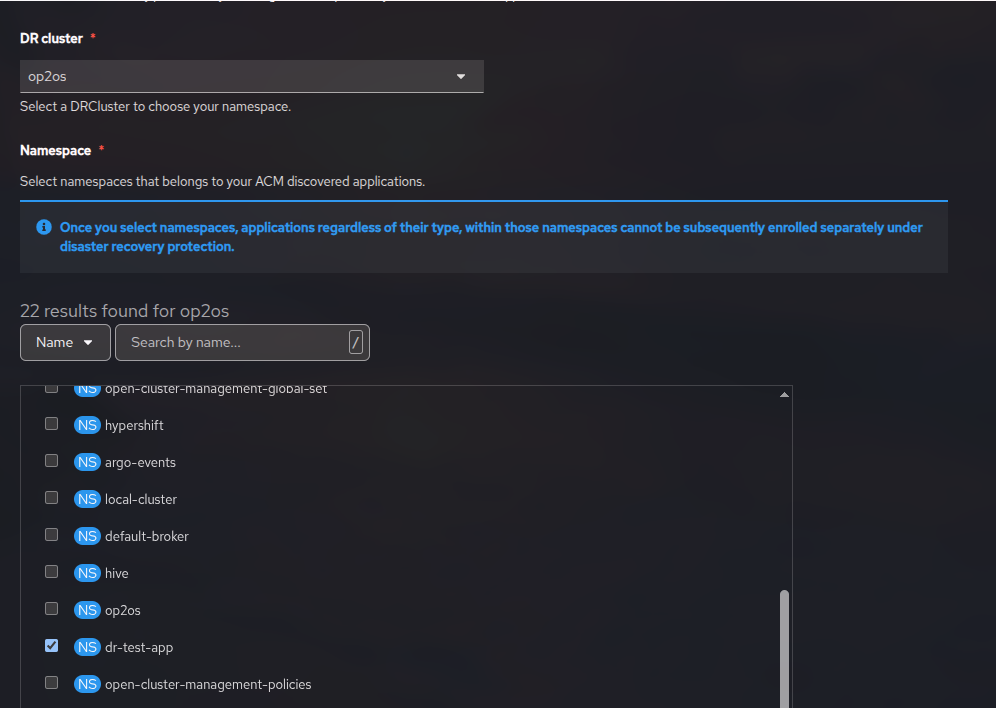
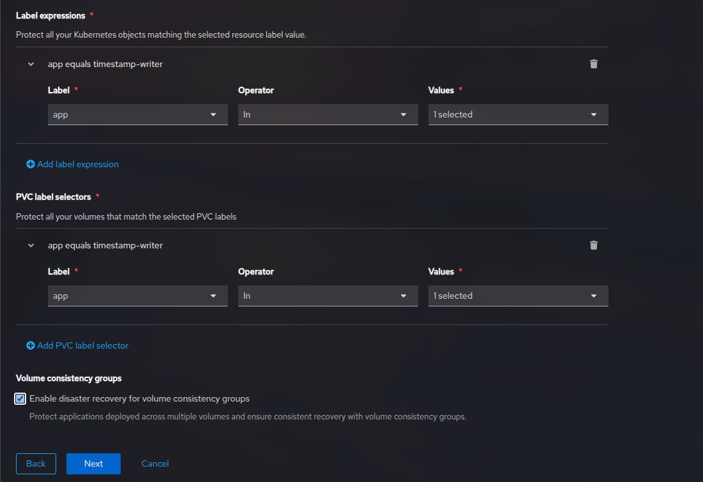
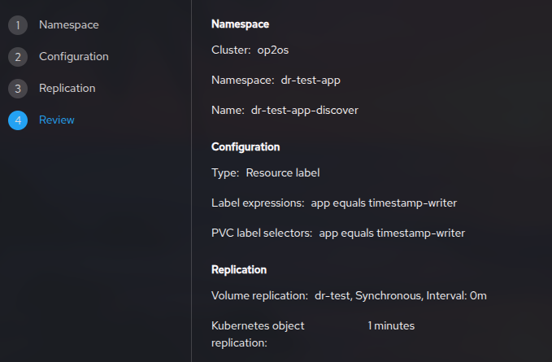

Zadatak: imamo dva clustera op1os i op2os. Op1os je hub cluster a op2os je managed cluster. Zadatak je složiti disaster recovery na aplikaciji u op2os tako da se aplikacija i njeni PVC-ovi prebace na op1os u slučaju crasha, dakle, nesmije biti data lossa.

Prije početka potrebno je skinuti ACM operator na glavnom HUB-u, te dodati drugi cluster (op2os).


Zatim odlazimo na All Clusters->Import Cluster i dolazimo na sučelje u kojem zadajemo ime i ostale vrijednosti dodatnog clustera i u određeno polje mu dajemo njegov kubeconfig.



Finalno stanje možemo vidjeti na ```All clusters```:


Na op1os ĆE BITI skinut 'Openshift DR Hub Operator', a na op2os 'Openshift DR Cluster Operator'. Opis instalacije ODF operatora je prethodno objašnjen u ODF.md dokumentaciji. (NAPOMENA: MI NISMO SKIDALI TE OPERATORE, ONI ĆE SE SAMI SKINUTI TEK NAKON INSTALACIJE ODF MULTICLUSTER OPERATORA, OVO JE SAMO OSTAVLJENO KAO NAZNAKA DA ČITATELJ VIDI TKO JE GLAVNI CLUSTER A TKO NE, UKOLIKO SE OVI OPERATORI RUČNO SKINU NASTAT ĆE MNOGO PROBLEMA)

Za test smo koristili jako jednostavnu bash skriptu koja ispisuje timestamp svakih 15 minuta u /timestamps/timestamp.log:

```
#!/bin/sh
while true; do
  echo "$(date)" >> /timestamps/timestamp.log
  sleep 15
done
```

Zatim smo napravili Dockerfile i buildali image:

```
FROM alpine:latest

WORKDIR /app

RUN mkdir -p /timestamps

COPY writer.sh /app/writer.sh

RUN touch /timestamps/timestamp.log && chmod +x /app/writer.sh && chmod 666 /timestamps/timestamp.log

CMD ["/bin/sh", "-c", ./writer.sh"]
```

```
$ docker build -t lvolarevic/timestamp-writer:latest .
$ docker push lvolarevic/timestamp-writer:latest
```
Zatim smo napravili pvc.yaml za naš external CEPH storage (jako je bitno dati label jer će se tako pozivati u mirroringu između clustera):

```
apiVersion: v1
kind: PersistentVolumeClaim
metadata:
  name: timestamp-pvc
  namespace: dr-test-app
  labels:
    app: timestamp-writer
spec:
  accessModes:
    - ReadWriteOnce
  resources:
    requests:
      storage: 1Gi
  storageClassName: ocs-external-storagecluster-ceph-rbd
```

```
oc apply -f pvc.yaml
```
te smo napravili jednostavan deployment koji primjenjuje naš PVC:

```
apiVersion: apps/v1
kind: Deployment
metadata:
  name: timestamp-writer
  namespace: dr-test-app
  labels:
    app: timestamp-writer
spec:
  replicas: 1
  selector:
    matchLabels:
      app: timestamp-writer
  template:
    metadata:
      labels:
        app: timestamp-writer
    spec:
      containers:
      - name: timestamp-writer
        image: lvolarevic/timestamp-writer:latest
        volumeMounts:
        - name: timestamp-storage
          mountPath: /timestamps
      volumes:
      - name: timestamp-storage
        persistentVolumeClaim:
          claimName: timestamp-pvc

```

```
$ oc apply -f deployment.yaml
```

Sada možemo vidjeti da svaki put kada izbrišemo pod da se u fileu timestamp.log i dalje nalaze stari timestampovi. 

Trebamo namjestiti SSL trust između naša dva clustera, pozivamo ove komande:

```
$ oc get cm default-ingress-cert -n openshift-config-managed -o jsonpath="{['data']['ca-bundle\.crt']}" > primary.crt
$ oc get cm default-ingress-cert -n openshift-config-managed -o jsonpath="{['data']['ca-bundle\.crt']}" > secondary.crt
```
Primary je op1os, secondary je op2os. Zatim stvaramo configmap u obliku:

```
apiVersion: v1
data:
  ca-bundle.crt: |
    -----BEGIN CERTIFICATE-----
    <copy contents of cert1 from primary.crt here>
    -----END CERTIFICATE-----

    -----BEGIN CERTIFICATE-----
    <copy contents of cert2 from primary.crt here>
    -----END CERTIFICATE-----

    -----BEGIN CERTIFICATE-----
    <copy contents of cert3 primary.crt here>
    -----END CERTIFICATE----

    -----BEGIN CERTIFICATE-----
    <copy contents of cert1 from secondary.crt here>
    -----END CERTIFICATE-----

    -----BEGIN CERTIFICATE-----
    <copy contents of cert2 from secondary.crt here>
    -----END CERTIFICATE-----

    -----BEGIN CERTIFICATE-----
    <copy contents of cert3 from secondary.crt here>
    -----END CERTIFICATE-----
kind: ConfigMap
metadata:
  name: user-ca-bundle
  namespace: openshift-config
```

te na oba clustera pozivamo:

```
$ oc create -f cm-clusters-crt.yaml
$ oc patch proxy cluster --type=merge  --patch='{"spec":{"trustedCA":{"name":"user-ca-bundle"}}}'
```

OK, imamo sada sve početne uvjete za napraviti disaster recovery. Naša je bit DR-a da se aplikacija sa PVC-om prebaci na cluster op1os u slučaju da se cluster 2 sruši.

Potrebno nam je da se svaka promjena u op2os vidi i u op1os, dakle, potreban nam je mirroring između dva clustera tako da op2os replicira PVC-ove na op1os.

Skidamo operator 'ODF Multiclaster Orchestrator' na HUB (op1os). Jako je bitno da prvo skidamo ovo (a ne dr operatori) te da su stavljeni u openshift-operators namespace, jer operatori u openshift-operators imaju cluster-wide domenu.






Stvaramo novi policy i odaberemo naše clustere op1os i op2os:



Sada su naša dva clustera povezana i moramo mu dodati pravila po što će se točno monitorati u toj vezi, stvaramo novu instancu monitoringa aplikacija te pratimo sučelje gdje odabiremo da želimo replicirati našu dr-test-app:



Sada odabiremo naše resurse preko labela koje smo zadali prije:



U konačnici to izgleda ovako:



Nakon kreacije odlazimo u yaml od policia i dodajemo:

```
spec:
  action: Failover
  failoverCluster: op1os
```

Nadalje je obavezno namjestiti fencing, zabranu propadajućeg clustera da piše išta u storage.

Odabiremo:

```
$ oc edit drcluster local-cluster
$ oc edit drcluster op2os
```

i dodajemo ip adrese naših nodeova u spec te sljedeće anotacije:

```
spec:
  cidrs:
  - 10.0.16.18/23
  - 10.0.16.19/23
  - 10.0.16.20/23
  s3ProfileName:  s3profile-local-cluster-ocs-external-storagecluster
```

```
spec:
  cidrs:
    10.0.16.21/23
    10.0.16.22/23
    10.0.16.23/23
    10.0.16.24/23
    10.0.16.25/23
  s3ProfileName:  s3profile-op2os-ocs-external-storagecluster
```

```
annotations:
    drcluster.ramendr.openshift.io/storage-clusterid: openshift-storage
    drcluster.ramendr.openshift.io/storage-driver: openshift-storage.rbd.csi.ceph.com
    drcluster.ramendr.openshift.io/storage-secret-name: rook-csi-rbd-provisioner
    drcluster.ramendr.openshift.io/storage-secret-namespace: openshift-storage
```

```
spec:
  clusterFence: Fenced # tamo gdje je aplikacija
```