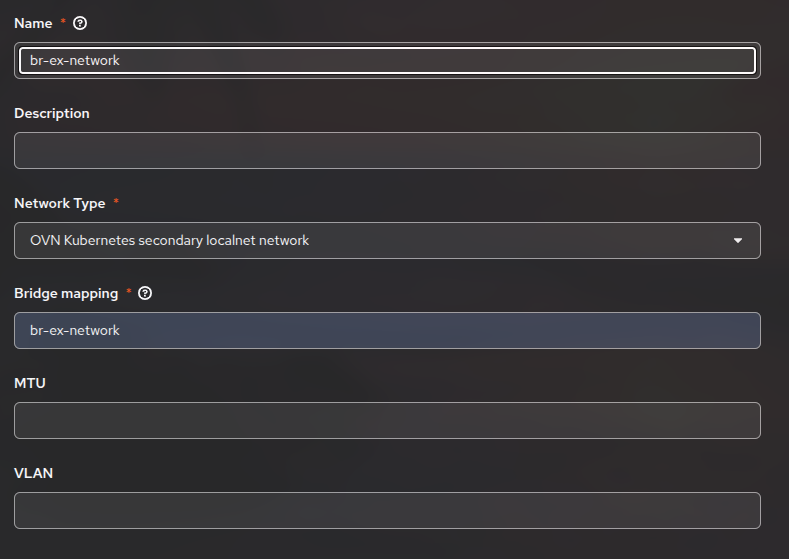
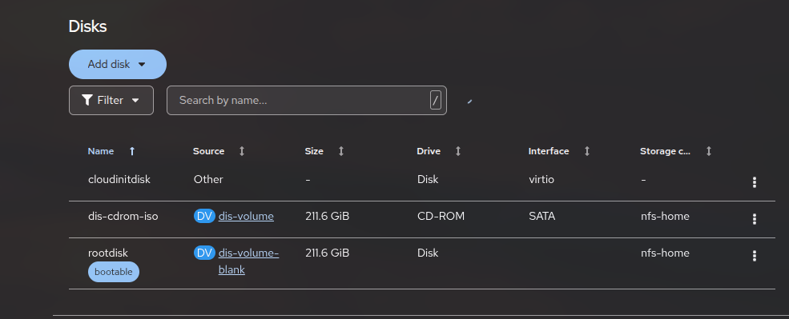
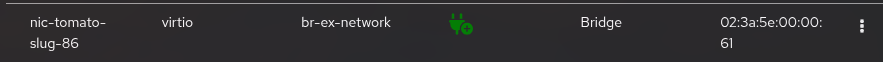
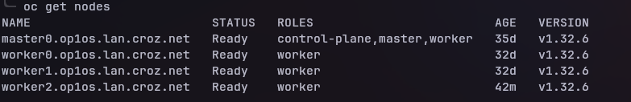

ukratko: skini coreos image, napravi volume, nfs za home dir, skini discovery image, namjesti oni bridging, napravi virtualku na novom nfsu sa tim imageom i barem 2cpu 8ram 120gb i sa tim interfaceom (obavezno ugasit pod networking) i stavit node selector koji smo prije annotirali, dodat host i onda approvat certifikate i onda 00-multus.conf.

Zadatak: U RemotePowerOn.md je objašnjen zadatak gdje smo s obzirom na metrike ili vrijeme odlučivali hoće li node biti upaljen ili ugašen. Ovaj zadatak je sličan, samo što ne koristimo fizički node već stvaramo Virtual Machine kojeg ćemo dodati kao workera. Zanimljivi detalj je da ćemo instancu virtualke vrtiti na samom Openshiftu.

## Početak

Prvi korak je stvoriti virtualku i dodati je kao node u cluster. Naime, virtualke po defaultu dobivaju pod networking, to znači da mogu komunicirati međusobno i s ostalim podovima u clusteru, ali ta je mreža izolirana, dakle nije u istoj mreži kao i sa nodovima. Zbog toga trebamo napraviti network bridging između nodea i virtualke. Prvi preduvjet je da se virtualka mora nalazit na jednom nodeu i tamo ostati jer ćemo koristiti bridging na osnovu imena interfacea. Pošto nodeovi imaju samo jednu mrežnu karticu, prisiljeni smo reusat već postojeći bridge (svaki node koji je dio clustera ima interface svoje mrežne kartice i interfacea bridgea između vlastitog networka i pod networka). Taj reuse može negativno utjecati na cluster pa trebamo stvoriti lokalnu mrežu na tom bridgeu. Ciljani node će biti worker1 (stvaramo worker2).

Da bismo ciljali worker1 za sve operacije, trebamo mu dodati distinktivni label, neka bude npr: choosealone="true". (zovemo `$ oc edit node worker1.op1os.lan.croz.net` i dodajemo taj label).

Onda stvaramo lokalni network na bridge interfaceu imena br-ex (ime smo detektirali tako da smo se s SSH povezali na node i pozvali `$ ip a`). Stvaramo NodeNetworkConfigurationPolicy:
```
apiVersion: nmstate.io/v1
kind: NodeNetworkConfigurationPolicy
metadata:
  name: br-ex-network
spec:
  nodeSelector:
    choosealone: true
  desiredState:
    ovn:
      bridge-mappings:
      - localnet: br-ex-network
        bridge: br-ex 
        state: present
```
Sada je local network `br-ex-network` stvoren na bridgeu `br-ex` te dalje trebamo povezati taj local network za novi interface kojeg ćemo prosljeđivati virtualki. To radimo s Networking->NetworkAttachmentDefinitions:

```
apiVersion: k8s.cni.cncf.io/v1
kind: NetworkAttachmentDefinition
metadata:
  annotations:
    k8s.ovn.org/network-id: '1'
    k8s.ovn.org/network-name: br-ex-network
  name: br-ex-network
  namespace: openshift-storage
spec:
  config: |-
    {
        "cniVersion": "0.4.0",
        "name": "br-ex-network",
        "type": "ovn-k8s-cni-overlay",
        "netAttachDefName": "openshift-storage/br-ex-network",
        "topology": "localnet"
    }
```



Jako je bitno da se odabere opcija `OVN Kubernetes secondary localnet network`, a ne `Bridging` jer mi ovdje ne stvaramo bridging interface, on već postoji, mi ga samo reusamo, ovo je interface koji se spaja na LOKALNU MREŽU koja postoji na bridgeu, to je workaround za nodeove s jednom mrežnom karticom. Da smo npr imali dvije mrežne kartice, na drugoj bi stvorili bridge i direktno bi se spojili na taj interface.

Više možete pročitati na: https://www.redhat.com/en/blog/access-external-networks-with-openshift-virtualization.

Također, za novi node trebamo DNS zapis, možemo napraviti privremeni mapping na svim nodeovima clustera u /etc/hosts (ovo je privremeno rješenje, kasnije ćemo tražiti od internog IT-a za DNS zapise)
`10.0.16.111 worker2.op1os.lan.croz.net`. Također dodamo mapping u `haproxy.conf`:

`server worker2 worker2.op1os.lan.croz.net:443 check port 1936 inter 1s`
`server worker2 worker2.op1os.lan.croz.net:80 check port 1936 inter 1s`
(referirajte se na dokumentaciju za instalaciju o clusteru za više informacija o HaProxyu)

Sada imamo preduvjete za stvoriti virtualku na mreži od nodeova (naravno, nije moguće dodati node u OpenShift cluster bez da su na istoj mreži).

Da bismo dodali node u cluster moramo pokreniti Core OS image sa worker ignition fileom.

### Prva metoda: 
odemo u konzolu od OpenShift profila (ne clustera), odaberemo naš cluster i odaberemo ADD HOSTS gdje možemo skinuti Discovery ISO. Ovo je najbrži način, samo bootamo taj Discovery ISO i Cluster će ga automatski pronaći, to je uglavnom samo Core OS image koji na instalaciji poziva worker ignition file. Kada stvaramo virtualku, odaberemo Create New Volume i odaberemo Discovery ISO iz našeg file systema. Zatim je jako bitno da odaberemo BAREM 2 CPU Corea i 8GB RAMa jer su to minimalni uvjeti za dodavanje nodea. Također trebamo alocirati barem 120GB na disk na koji će biti skinut Core OS (naravno bitno je provjeriti da na external storage systemu ima dovoljno mjesta). Postoje dva diska na virtualci, ISO Disk i rootdisk, mi trebamo povećati rootdisk (i odabrati ga kao bootable nakon instalacije) jer je ISO Disk samo velićina LIVE ISO environmenta. 

Sada trebamo otići u naprednu konfiguraciju i odabrati Node Selector i staviti label `choosealone=true` te dodati novi Network Interface (samo odaberemo naš br-ex-network):

Gotovi smo s konfiguracijom, možemo kreirati virtualku. Sada samo ostavimo da se instalira, u `nmtui` namjestimo static IP na gore navedenu adresu te nazad u konzoli ćemo vidjeti da je novi node pronađen i pisat će jesu li svi preduvjeti uredni (RAM, CPU itd.). U slučaju da dođe error `Worker ignition file unreachable.` potrbeno je provjeriti gdje se točno nalazi. Meni je automatski gledalo api.op1os.lan.croz.net, ali pošto je op1os cluster u početku bio Single Node cluster potrebno je odabrati Bootstrap Node što je meni bio master0.op1os.lan.croz.net i onda će ispravno povući worker ignition. Ostavimo da se instalira, u konzoli odaberemo Add Worker, imenujemo ga i to je to. Sada odimo na cluster i pogledajmo s `$ oc get csr` pending certifikate te ih možemo sve potvrditi s komandom `$ oc get csr -o go-template='{{range .items}}{{if not .status}}{{.metadata.name}}{{"\n"}}{{end}}{{end}}' | xargs --no-run-if-empty oc adm certificate approve`

Pozovimo komandu `$ oc get nodes` te vidimo da je sve uredno:


### Druga metoda
Ako nemamo linkan Red Hat profil s našim Clusterom, možemo izvući ignition file s komandom:
```
$ oc extract -n openshift-machine-api secret/worker-user-data-managed --keys=userData --to=- > worker.ign
```
sada trebamo napraviti mali python server na mreži koji hosta worker.ign na nekom portu (i privremeno maknuti firewall sa tog porta):
```
#!/usr/bin/env python3
import http.server
import socketserver
from pathlib import Path

PORT = 9956
IGNITION_FILE = Path("./worker.ign") # neka worker.ign bude u istom folderu

class IgnitionHandler(http.server.SimpleHTTPRequestHandler):
    def do_GET(self):
        if self.path.endswith(""):
            self.send_response(200)
            self.send_header("Content-type", "application/json")
            self.end_headers()
            with open(IGNITION_FILE, "rb") as f:
                self.wfile.write(f.read())
        else:
            self.send_response(404)
            self.end_headers()

with socketserver.TCPServer(("", PORT), IgnitionHandler) as httpd:
    print(f"Serving {IGNITION_FILE} on port {PORT}")
    httpd.serve_forever()


```
Sada možemo instalirati običnu Core OS sliku s interneta te stvoriti volume sa njom. Kada se instalira pozovemo:
```
$ sudo coreos-installer install /dev/vda --ignition-url http://10.0.16.76:9956/worker.ign --insecure-ignition
```
(disk identificiramo s `$ lsblk`)
Sačekamo instalaciju te pratimo sve ostale korake kao i u prvoj metodi samo bez koraka u konzoli.

### Napomena
Za vrijeme instalacije nodea može se dogoditi da nedostaje jedan file te se zbog njega pokazuje da je node `Not Ready`. Naime, u logovima od nodea možemo vidjeti da traži CNI definiciju te da je ne može pronaći:
```
network not ready: NetworkReady=false reason:NetworkPluginNotReady message:Network plugin returns error: no CNI configuration file in /etc/kubernetes/cni/net.d/. Has your network provider started?
```

File u pitanju je /etc/kubernetes/cni/net.d/00-multus.conf. Workaround je da odemo u već postojeći node te kopiramo taj file i prenesemo ga na novi node u isti path pod istim imenom te restartamo kubelet s `$ systemctl restart kubelet` i onda će node biti `Ready`. 

## Konfiguracija remote paljenja i gašenja