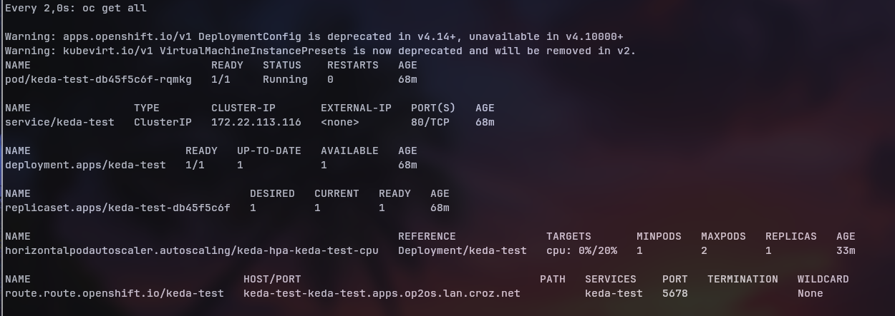
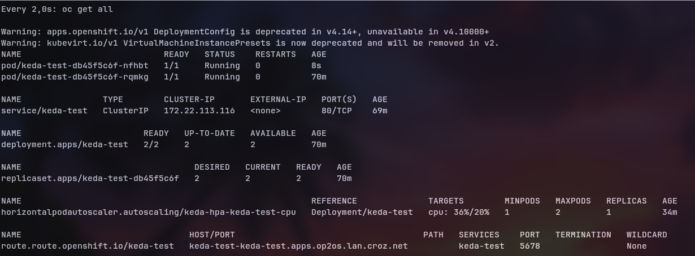
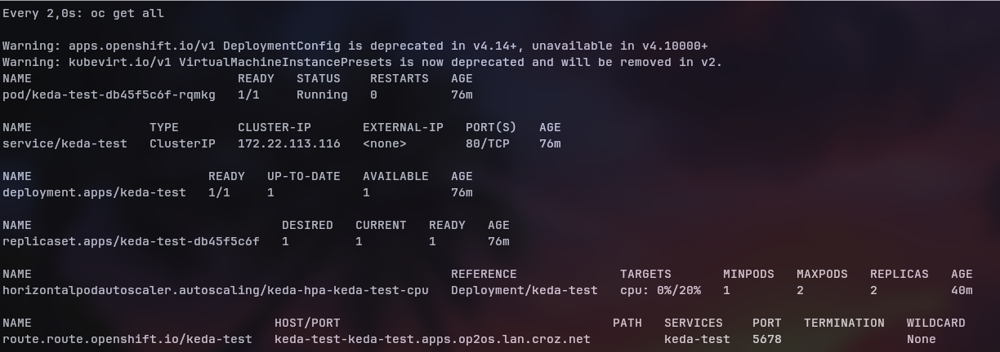
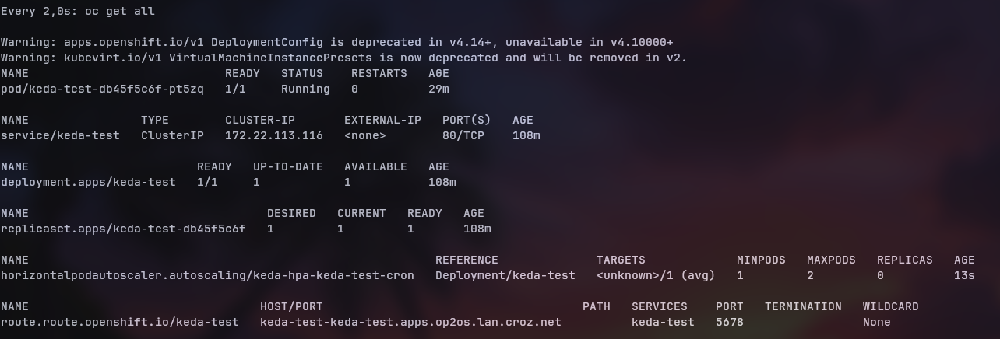
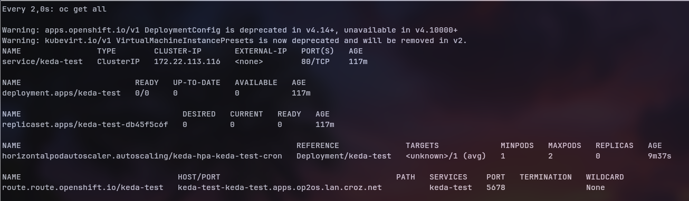
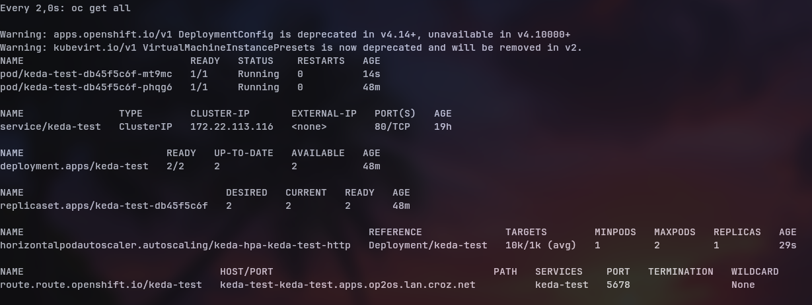
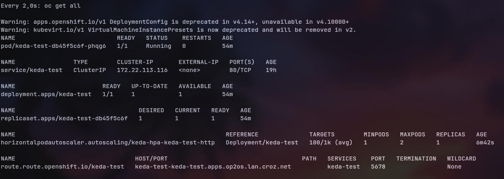

KEDA je platforma koja služi za autoscalanje. Zadatak je da napravimo scalanje na osnovu na 3 stvari: cron, cpu i metrics.

### Početak

Instalaciju možemo obaviti preko helma ili preko operatora. Pratimo https://keda.sh/docs/2.17/deploy/. KEDA operator je depricated tako da koristimo helm chartove.

Prvo dodajemo helm repos:
```
$ helm repo add kedacore https://kedacore.github.io/charts

$ helm repo update
```

Zatim instaliramo KEDA package i stvaramo novi namespace ```keda```
```
$ helm install keda kedacore/keda --namespace keda --create-namespace
```
Idemo na https://github.com/kedacore/keda/releases/tag/v2.17.2 te skidamo ```keda-2.17.2-crds.yaml``` i zatim applyamo taj custom resource definition:
```
oc apply -f keda-2.17.2-crds.yaml
```
Provjerimo instalaciju:
```
$ oc get crd | grep keda

cloudeventsources.eventing.keda.sh                                        2025-08-25T12:34:48Z
clustercloudeventsources.eventing.keda.sh                                 2025-08-25T12:34:48Z
clustertriggerauthentications.keda.sh                                     2025-08-25T12:34:48Z
scaledjobs.keda.sh                                                        2025-08-25T12:34:48Z
scaledobjects.keda.sh                                                     2025-08-25T12:34:48Z
triggerauthentications.keda.sh                                            2025-08-25T12:34:48Z
```

Instalacija je gotova

## Zadatak

Za potrebe ovog zadatka ćemo koristiti jednostavni deployment koji otvara http server.
```
apiVersion: apps/v1
kind: Deployment
metadata:
  name: keda-test
  labels:
    app: keda-test
spec:
  replicas: 1
  selector:
    matchLabels:
      app: keda-test
  template:
    metadata:
      labels:
        app: keda-test
    spec:
      containers:
      - name: http-server
        image: hashicorp/http-echo
        args:
          - "-text=Hello KEDA"
        ports:
          - containerPort: 5678
        resources:
          requests:
            cpu: 100m
          limits:
            cpu: 500m

```

Zatim ćemo napraviti jednostavni service:
```
apiVersion: v1
kind: Service
metadata:
  name: keda-test
  labels:
    app: keda-test
spec:
  selector:
    app: keda-test
  ports:
    - protocol: TCP
      port: 80
      targetPort: 5678
```

i pozvati ```$ oc expose svc/keda-test``` te dobiti ```keda-test-keda-test.apps.op2os.lan.croz.net```

### Prvi dio (CPU)
Želimo napraviti KEDA Autoscaler tako da je minimalni broj podova 1, a kada je CPU iskorištenost iznad 50% onda će se scaleupati na dvije replike.

Napravimo jednostavan ScaledObject
```
apiVersion: keda.sh/v1alpha1
kind: ScaledObject
metadata:
  name: keda-test-cpu
spec:
  scaleTargetRef:
    name: keda-test
  minReplicaCount: 1
  maxReplicaCount: 2
  triggers:
  - type: cpu
    metadata:
      type: Utilization
      value: "20"   # Ako je CPU opterecenje iznad '20%' od definiranog requested CPU valuea

```
i nakon što applyamo vidimo novi HPA:
```
NAME                                                         REFERENCE              TARGETS       MINPODS   MAXPODS   REPLICAS   AGE
horizontalpodautoscaler.autoscaling/keda-hpa-keda-test-cpu   Deployment/keda-test   cpu: 0%/1%   1         2         1          10m
```

Sada možemo ovako promatrati:
ovo je standardno stanje:



Ovaj image je iznimno lightweight jer je to samo mala Go binarna datoteka, sada ćemo morati napraviti malo prometa da bi povećai CPU%. Otvorit ćemo nekoliko novih terminala i pokrenuti ovu skriptu:
```
$ while true; do curl -s http://keda-test-keda-test.apps.op2os.lan.croz.net > /dev/null; done
```
i sada možemo vidjeti ovakvo stanje:



Sad ugasimo sve terminale i spustimo CPU usage na 0% i sačekamo otprilike 5 minuta vidimo povrat na početno stanje:



### Drugi dio (CRON)
Sada nam je cilj napraviti cron job. Zadatak je da aplikacija ima 2 poda između 9h i 17h, a izvan radnog vremena se podovi ugase i broj replica bude 0. Ovime imitiramo stvarne potrebe ograničavanja trošenja resursa (i novaca) u poslovnim okruženjima.

Stvaramo novi ScaledObject:
```
apiVersion: keda.sh/v1alpha1
kind: ScaledObject
metadata:
  name: keda-test-cron
spec:
  scaleTargetRef:
    name: keda-test
  minReplicaCount: 0
  maxReplicaCount: 2
  triggers:
  - type: cron
    metadata:
      start: "0 9 * * *"
      end: "0 17 * * *"
      timezone: "Europe/Zagreb"
      desiredReplicas: "2"
      pollingInterval: "30"

```
Ovo je stanje prije:



i stanje poslje kreiranja HPA


Idemo promijeniti end u 14h (sada je 16:44) i trebat ćemo vidjeti 0 podova:



### Treći dio (Metrics)

Ovaj dio je jako sličan već napravljenom zadatku gdje smo s Prometheusom scrapeali metrike i s obzirom na njih radimo pojedine patcheve na deployment.yaml. Koristimo već napravljen Service Monitor u prethodnoj Monitoring dokumentaciji i radimo yaml za Scaled Object:
```
apiVersion: keda.sh/v1alpha1
kind: ScaledObject
metadata:
  name: keda-test-http
spec:
  scaleTargetRef:
    name: keda-test
  minReplicaCount: 1
  maxReplicaCount: 2
  triggers:
  - type: prometheus
    metadata:
      serverAddress: http://prometheus-operated-prometheus.apps.op2os.lan.croz.net
      metricName: current_connections
      threshold: "1000"
      query: current_connections
```
Kao u starom zadatku, metrike mijenjamo ručno te vidimo rezultate kada je current_connections>1000:



te kada je current_connections<1000:


