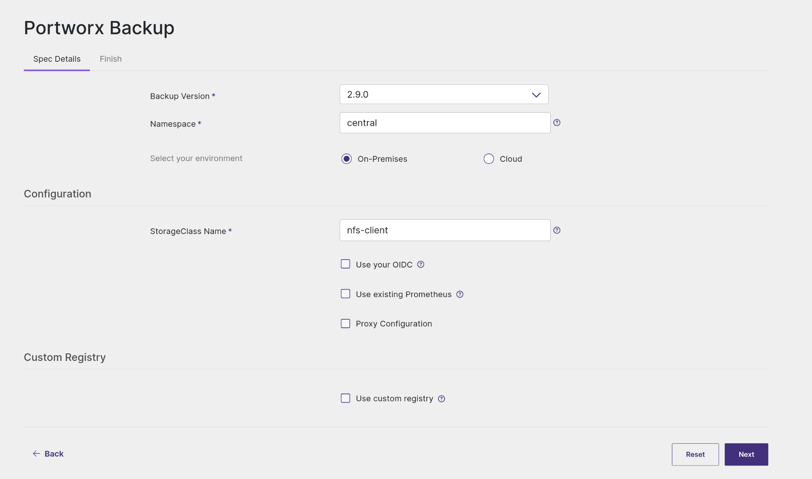
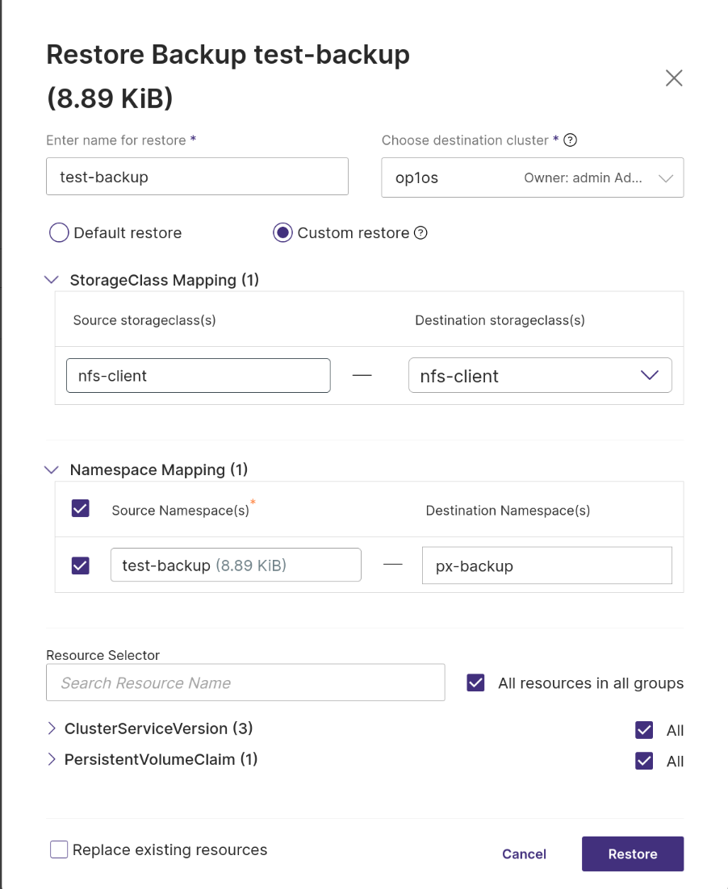

## Postavljanje PX-CSI

Sa Portworx [product line](https://central.portworx.com/specGen/wizard) stranice postavljamo i preuzimamo PX-CSI. 
Zatim ga preuzimamo u yaml obliku i primjenimo u cluster:

```
kind: StorageCluster
apiVersion: core.libopenstorage.org/v1
metadata:
  name: px-cluster-c12a02e5-55f5-49f9-9607-4b9391489eda
  namespace: portworx
  annotations:
    portworx.io/install-source: "<install-url>"
    portworx.io/is-openshift: "true"
    portworx.io/misc-args: "--oem px-csi"
spec:
  image: portworx/oci-monitor:25.6.0
  imagePullPolicy: Always
  kvdb:
    internal: true
  cloudStorage:
    kvdbDeviceSpec: size=32
  startPort: 17001
  stork:
    enabled: false
  csi:
    enabled: true
  monitoring:
    telemetry:
      enabled: true
    prometheus:
      enabled: true
      exportMetrics: true
  env:
  - name: PURE_FLASHARRAY_SAN_TYPE
    value: "ISCSI"
```

Primjenom ovoga kreirat će se CSI driver, StorageClass i StorageCluster. 

## Instalacija PX Backup     

Instalaciju ćemo napraviti na *central* namespaceu, ali prije toga potrebno je promjeniti service accounte:

```
oc adm policy add-scc-to-user restricted system:serviceaccount:central:default
oc adm policy add-scc-to-user restricted system:serviceaccount:central:pxcentral-apiserver
oc adm policy add-scc-to-user restricted system:serviceaccount:central:px-keycloak-account
oc adm policy add-scc-to-user restricted system:serviceaccount:central:px-backup-account
```

Sa [službene stranice](https://central.portworx.com/specGen/wizard) odabiremo opciju Backup Services, složimo se sa EULA pravilima i počinjemo Free Trial.



Za storage class odaberemo *nfs-client* kojeg smo napravili ranije, dok ostale opcije ostavimo na default.

U idućem prozoru dobijemo kod za helm instalaciju:

```
helm repo add portworx http://charts.portworx.io/ && helm repo update
```

Od dva tipa instalacije odabiremo drugi sa *values-px-central.yaml* konfiguracijom:

```
helm install px-central portworx/px-central --namespace central --create-namespace --version 2.9.0 -f values-px-central.yaml
```

Nakon instalacije exposeamo *service/px-backup-ui* i pristupamo konzoli. Početni username je *admin*, password također *admin*, ali UI odmah traži izmjenu passworda. 

Kada se ulogiramo trebamo dodati prvi cluster, odabiremo opciju Others.


Prije dodavanja treba instalirati Stork:

```
curl -fsL -o stork-spec.yaml "https://install.portworx.com/pxbackup?comp=stork&storkNonPx=true"
oc apply -f stork-spec.yaml
```

Zatim je potrebno dodati novi Backup destination - NFS server (*Cloud Settings -> Backup Locations -> Add*).


*NAPOMENA 1: Na NFS serveru kreirat će se novi folderi i resursi na koje po defaultu backup podovi neće imati pristup. Zbog toga je potrebno postaviti odgovarajuća prava pristupa na root folder (/nfs/exports) i omogućiti da svi novokreirani resursi preuzimaju prava pristupa od parent foldera.


*NAPOMENA 2: Portworx Backup je zamišljen i najbolje radi kao nadogradnja za Portworx Enterprise. PX Enterprise tu služi kao cijeli storage orchestrator koji kontrolira fizički smještaj podataka po nodeovima, i zajedno sa PX Backup omogućava  automatizaciju, konzistentne snapshotove i disaster recovery. NFS rješenje je jako ograničeno i sporo.

Cluster s 2 worker noda ne može postaviti PX Enterprise StorageCluster jer je minimum 3 workera. Zbog toga koristimo NFS za demonstraciju.


## Testiranje

Za testiranje kreiramo novi namespace, pvc i pod koji samo ispisuje trenutni datum u datoteku:

```
apiVersion: v1
kind: PersistentVolumeClaim
metadata:
  name: test-pvc
  namespace: px-test
spec:
  accessModes:
    - ReadWriteOnce
  resources:
    requests:
      storage: 1Gi
  storageClassName: px-csi-db # koristi StorageClass koji ti je Portworx kreirao
---
apiVersion: apps/v1
kind: Deployment
metadata:
  name: test-app
  namespace: px-test
spec:
  replicas: 1
  selector:
    matchLabels:
      app: test-app
  template:
    metadata:
      labels:
        app: test-app
    spec:
      containers:
      - name: app
        image: busybox
        command: ["/bin/sh", "-c", "while true; do date >> /data/out.txt; sleep 5; done"]
        volumeMounts:
        - mountPath: /data
          name: data
      volumes:
      - name: data
        persistentVolumeClaim:
          claimName: test-pvc
---
apiVersion: v1
kind: Service
metadata:
  name: test-service
  namespace: px-test
spec:
  selector:
    app: test-app
  ports:
  - protocol: TCP
    port: 80
    targetPort: 80
```

Kroz UI kreiramo novo backup pravilo (*Clusters -> op1os -> Create Backup -> odabir namespacea za backup -> Backup*):


Pokrećemo restore na novi namespace (*px-backup*):



I vidimo da je restoran pvc.


