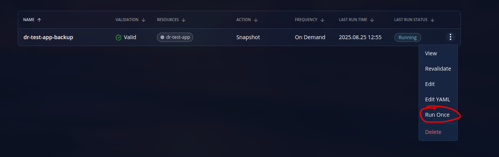

Veeam Kasten je data protection platforma koja pruža backup Kubernetes aplikacija, pruža disaster recovery rješenja i pruži usluge repliciranja preko reusable pravila kojih sami zadamo.

### Početak

Prvo stvaramo Kasten profil s poslovnim mailom te ga verificiramo.

Skidamo Veeam Kasten za Openshift cluster: https://docs.kasten.io/latest/install/openshift/openshift/

Možemo skinuti preko helma i preko operoatora. Idemo preko operatora: https://docs.kasten.io/latest/install/openshift/operator

Stvaramo novi project:

```
$ oc new-project kasten-io \
  --description="Kubernetes data management platform" \
  --display-name="Veeam Kasten"
```

zatim pratimo gore navedenu dokumentaciju.

---

### Instalacija

Skidamo Kasten operator:


Zatim stvaramo k10 instancu unutar operatora, ostavljamo default settings, jedino postavljamo ```Token Based Authentication``` i ```Enable Exposed Route```. Za authentication password idemo na desni kut, stisnemo ```kubeadmin``` i odabiremo ```Copy login command``` te odabiremo ```Display token```. k10 instanca koristi default storageClass, a mi ćemo koristiti nfs-client storageClass.

Za potrebe testiranja backupa koristimo ponovno istu aplikaciju kao za ODF testiranje:
```
apiVersion: apps/v1
kind: Deployment
metadata:
  name: timestamp-writer
  namespace: dr-test-app
  labels:
    app: timestamp-writer
spec:
  replicas: 1
  selector:
    matchLabels:
      app: timestamp-writer
  template:
    metadata:
      labels:
        app: timestamp-writer
    spec:
      containers:
      - name: timestamp-writer
        image: lvolarevic/timestamp-writer:latest
        pullPolicy: ifNotPresent
        volumeMounts:
        - name: timestamp-storage
          mountPath: /timestamps
      volumes:
      - name: timestamp-storage
        persistentVolumeClaim:
          claimName: timestamp-pvc

```
```
apiVersion: v1
kind: PersistentVolumeClaim
metadata:
  name: timestamp-pvc
  namespace: dr-test-app
  labels:
    app: timestamp-writer
spec:
  accessModes:
    - ReadWriteOnce
  resources:
    requests:
      storage: 1Gi
  storageClassName: ocs-external-storagecluster-ceph-rbd
```

Odlazimo na dashboard od Kastena na http://k10-route-kasten-io.apps.op2os.lan.croz.net/k10 te odabiremo našu aplikaciju i odabiremo ```Create a policy```


Zatim odabiremo naš novi kreirani policy i odabiremo ```Run once``` da bi stvorili naš snapshot



Za vrijeme instalacije sam naišao na problem:
```
Job failed to be executed
 Failed snapshot precheck for workload
 Failed to check for CSI PVC
 Failed to run CSI prechecks for PVC
 Failed to get K10 VolumeSnapshotClass
 Failed to find VolumeSnapshotClass with annotation in the cluster
```
Kasten traži VolumeSnapshotGroup koji ima anotaciju: ```k10.kasten.io/is-snapshot-class: "true"```

Pogledajmo naše VolumeSnapshotGroupove:
```
oc get VolumeSnapshotClass
NAME                                                 DRIVER                                  DELETIONPOLICY   AGE
ocs-external-storagecluster-cephfsplugin-snapclass   openshift-storage.cephfs.csi.ceph.com   Delete           17d
ocs-external-storagecluster-rbdplugin-snapclass      openshift-storage.rbd.csi.ceph.com      Delete           17d
```

Dodajmo anotaciju na rbd:
```
$ oc annotate volumesnapshotclass ocs-external-storagecluster-rbdplugin-snapclass k10.kasten.io/is-snapshot-class=true

```
Sada kad restartamo policy sve će biti u redu.

Kada odemo na ```Restore points``` vidimo da se tu nalaze naši snapshotovi.

Sada možemo izbrisati naš deployment i pvc s:
```
$ oc delete deployment.apps/timestamp-writer

$ oc delete pvc timestamp-pvc
```

U ```Restore points``` odaberemo željeni snapshot


I vidimo da sve radi ispravno:
```
$ oc get all
NAME                                    READY   STATUS    RESTARTS   AGE
pod/timestamp-writer-78f5bd9749-z7p5m   1/1     Running   0          36s

NAME                               READY   UP-TO-DATE   AVAILABLE   AGE
deployment.apps/timestamp-writer   1/1     1            1           36s

NAME                                          DESIRED   CURRENT   READY   AGE
replicaset.apps/timestamp-writer-78f5bd9749   1         1         1       36s

$ oc get pvc
NAME            STATUS   VOLUME                                     AGE
timestamp-pvc   Bound    pvc-993e0f08-5673-4a9e-a012-9464fc63e1ab   75s

```
